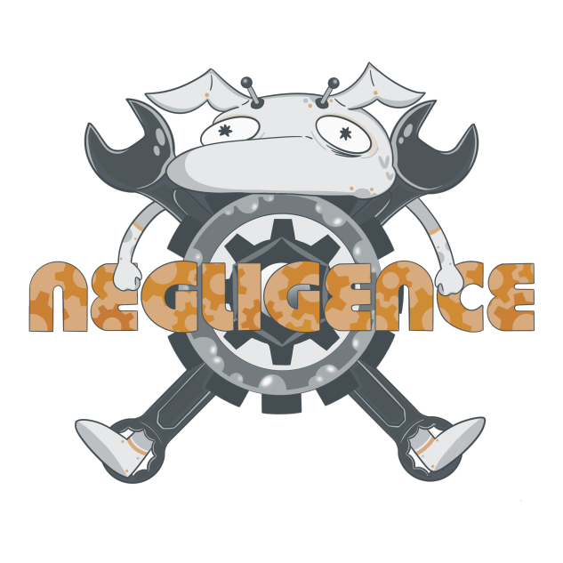

# AtoRov (a Negligence project)
> Autonomous Rover written in Arduino.

### component we use:
- arduino uno
- pixy2
- servo
- motor driver
- bla bla bla

### file management describtion here:
- README.md is project description. You can learn how to edit using mark down by reading [this](https://about.gitlab.com/handbook/markdown-guide/) article.
- you can find all the diagram in the diagram folder!
  - flow charts
  - eletrical diagram
  - ...idk
- you can find all the code in code folder!  
  - here's a quick view at what's in that folder.
  - main.ino is main code, **please comment the code!**
  - rough.ino is pseudo code, you can also view it [here](https://docs.google.com/document/d/1YSSXJ3OUwgdDNNxMu8pstoW31_rIilNodYSdIQzhhe8/edit?usp=sharing)
  - idea.txt is for new ideas. add findings, ideas here!
- you can find all the documentation for our project in the document folder
  - here's a quick view at what's in that folder.
  - project logo
  - charts and things of less of interest
  - ...okay i really don't know. don't ask me. plz.

### packages
For the code to work you need to download the following libraryies

- [pixy2 library](https://pixycam.com/downloads-pixy2/). (be very careful as pixy library is different from pixy2.)

- [motor driver library](https://github.com/CytronTechnologies/CytronMotorDriver)(follow the installation instruction in the linked page)

## other helpful links

= [pixy2 line tracking documentation](https://docs.pixycam.com/wiki/doku.php?id=wiki:v2:line_api)
